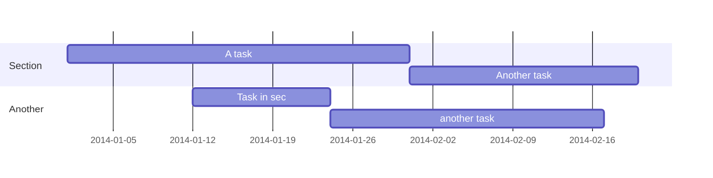
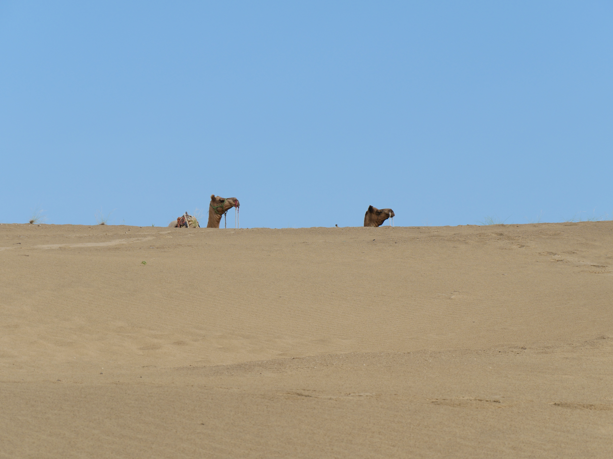
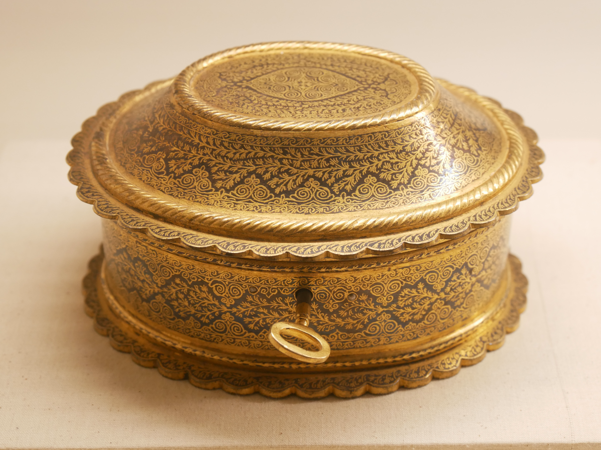
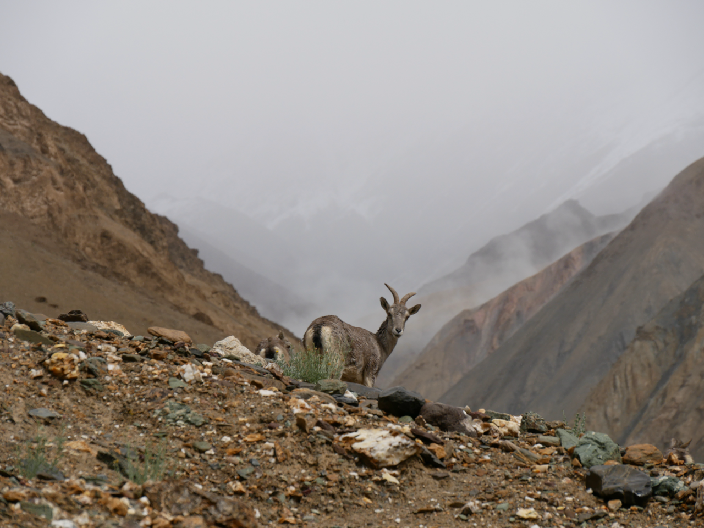
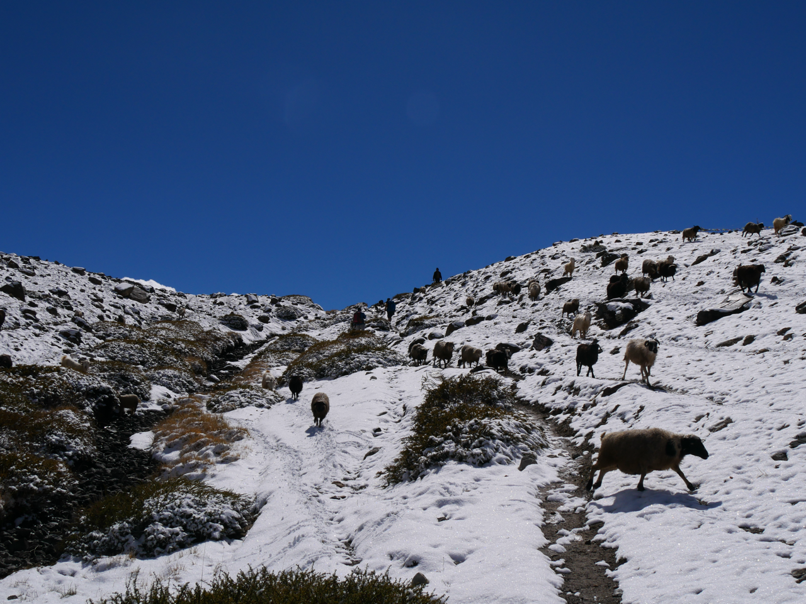
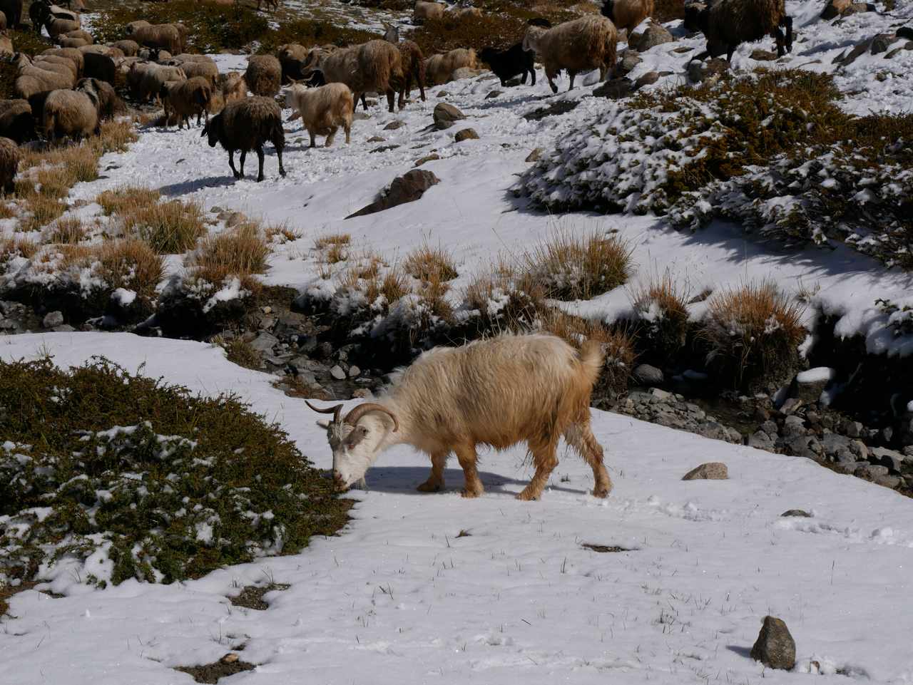

Add your *content* here...

Je suis également responsable de surveiller l'avancement du projet et de résoudre tout problème technique qui pourrait survenir pendant la rénovation.

## Heading 2
### Heading 3
#### Heading 4


> This is a blockquote.


Italics with _underscores_.

Bold with **asterisks**.

Combined emphasis with **asterisks and _underscores_**.

Strikethrough with ~~two tildes~~.


```markmap {height="200px"}
- Hugo Modules
  - wowchemy
  - wowchemy-plugins-netlify
  - wowchemy-plugins-netlify-cms
  - wowchemy-plugins-reveal
```


```markmap
- Mindmaps
  - Links
    - [Wowchemy Docs](https://wowchemy.com/docs/)
    - [Discord Community](https://discord.gg/z8wNYzb)
    - [GitHub](https://github.com/wowchemy/wowchemy-hugo-themes)
  - Features
    - Markdown formatting
    - **inline** ~~text~~ *styles*
    - multiline
      text
    - `inline code`
    -
      ```js
      console.log('hello');
      console.log('code block');
      ```
    - Math: $x = {-b \pm \sqrt{b^2-4ac} \over 2a}$
```














