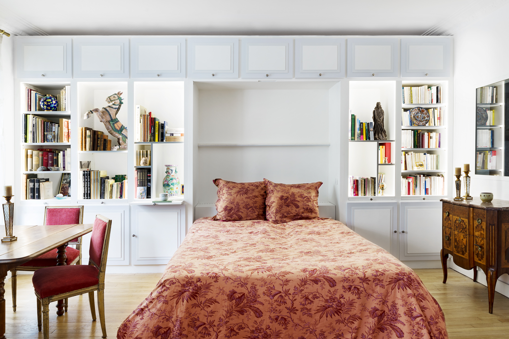
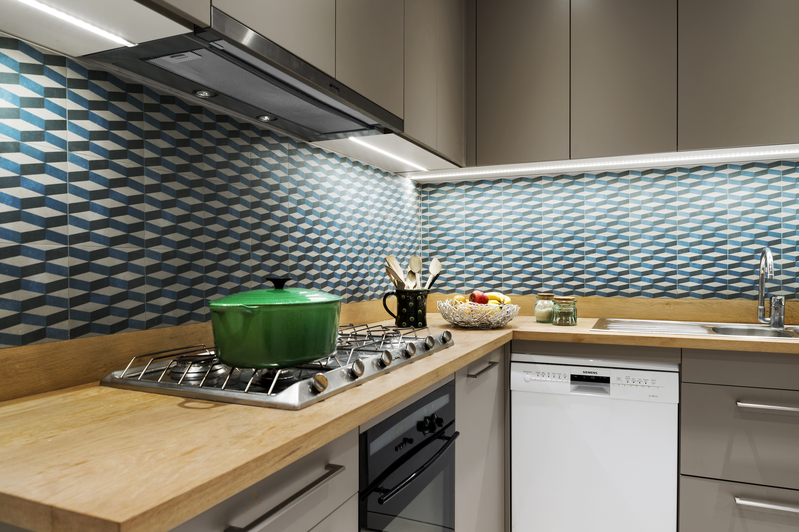
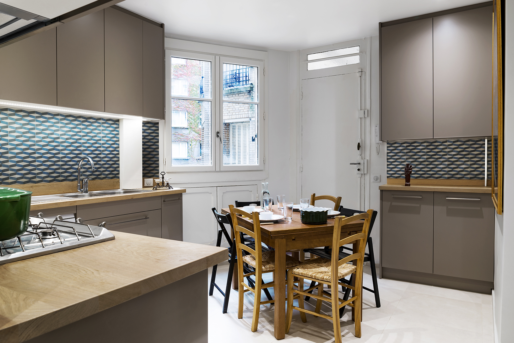
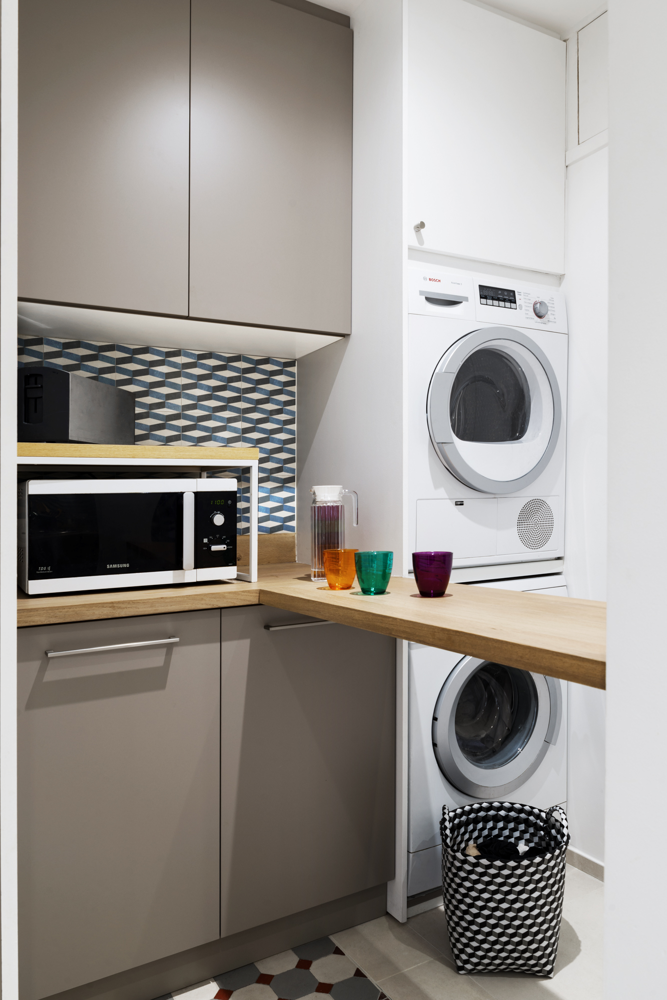
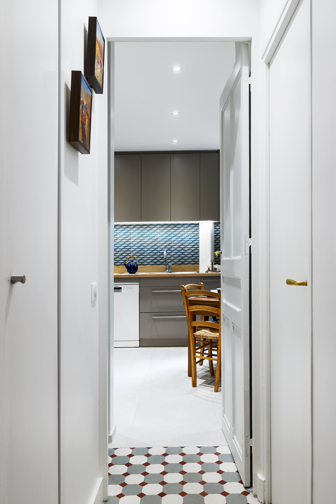
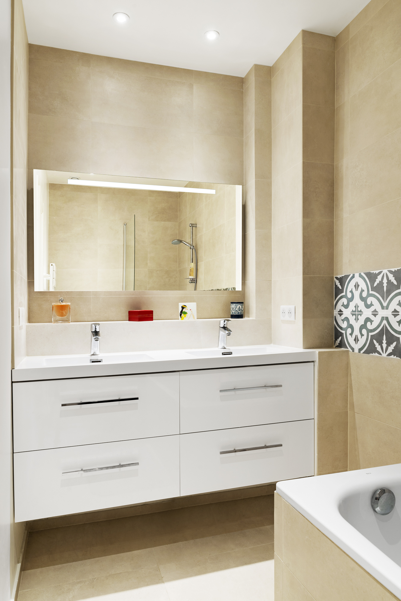
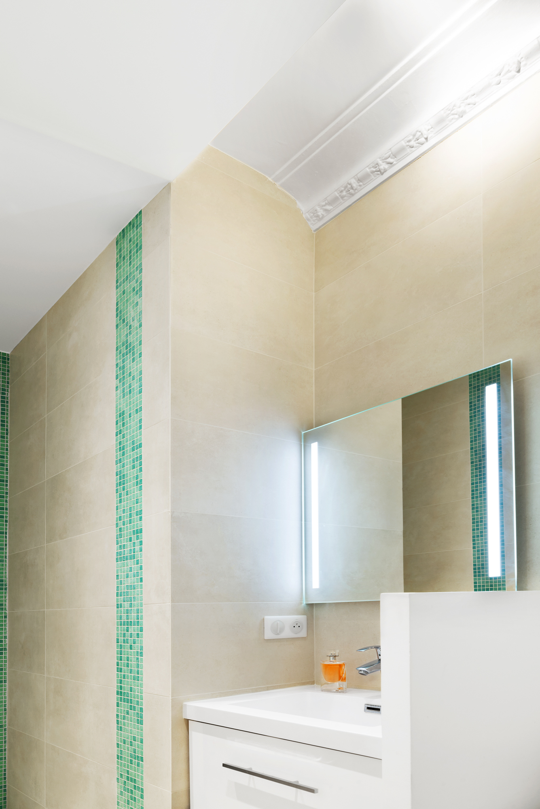
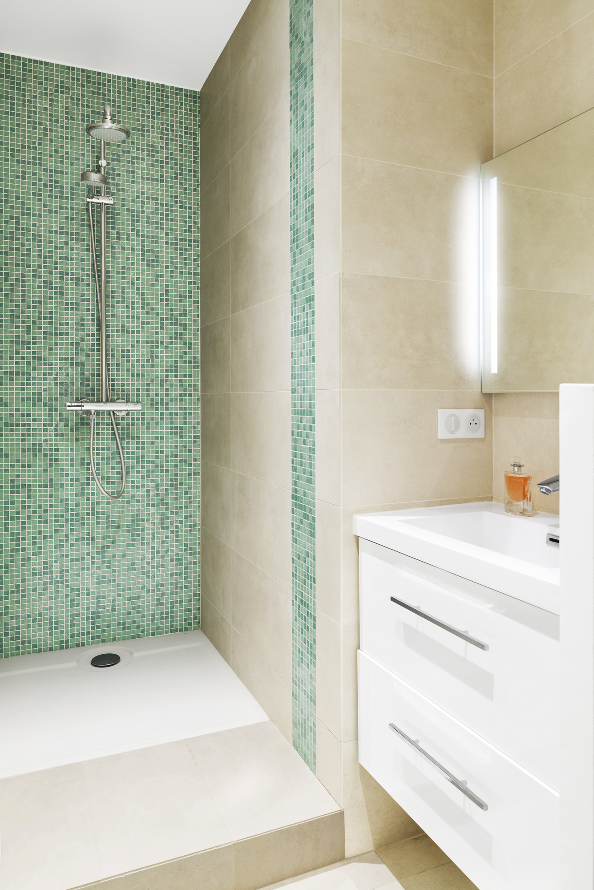

> ## Famille de 2 adultes et 3 adolescents, 1 jeune garçon. 
> ## Immeuble 1930. 
> ## 145 m². 
> ## Six mois de travaux.

Cinq pièces à transformer en 6 pièces. L’ensemble nécessite une refonte technique complète : l’ensemble de l’appartement est restructuré pour trouver une chambre supplémentaire, recréer une salle d’eau avec des WC et recréer une salle de bain et une buanderie en déplaçant et transformant un ancien office. Changement du cloisonnement, salle de bains et salles d’eau, cuisine et buanderie, chambres.  Electricité, plomberie, murs, sols et plafond seront entièrement repris.

Les travaux ont permis de découvrir des fuites en cours mais non encore visible et de les réparer.

Les chambres des jeunes sont dans la partie nuit de l’appartement et se regroupent autour de la salle d’eau et d’un sanitaire. Chaque chambre est équipée d’une penderie pour permettre un rangement indépendant. La cuisine et le coin buanderie sont disposés dans un même volume. Un comptoir permet de traiter le linge ou de faire office de bar pour un repas rapide. Entre buanderie et couloir une penderie séparative permet via un double accès de déposer et retirer le linge. 

Une grande bibliothèque occupe la longueur d’une paroi de la salle à manger pour permettre une mise en valeur des ouvrages et d’objets d’art ou d’artisanat. Elle accueille dans une niche un système de couchage (vrai lit basculant) invisible et intégré aux éléments de rangements. 

L’appartement situé au 1er étage manque de clarté aussi l’ensemble sera traité sur rue et sur cour avec des teintes claires. Les pièces de réception sont traitées dans un camaïeu de blanc et gris clair, et le parquet poncé est chêne clair, les éléments de bibliothèque et penderies dans les chambres sont peints en blanc pur à l’identique des pièces concernées. Les salles d’eau et salle de bains sont une variation colorée avec en base un ton sable ou beige clair. Mosaïques en tesselles vert d’eau pour les enfants, frises géométriques classiques en carreaux de grès pour les parents. La cuisine est également claire, ton marron glacé pour les façades, plan de travail en chêne brut et crédence en grès de formes géométriques bleu et gris. Le jeu coloré tranchant avec la neutralité de l’ensemble. Les carreaux de sol découvert lors de la démolition de l’existant ont été conservés et remployer en décoration de sol. 

