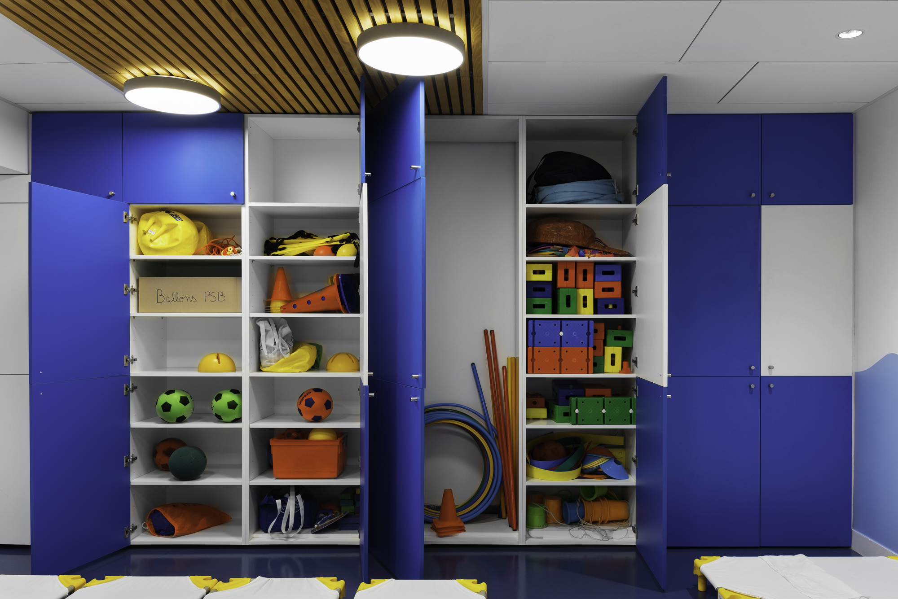

## 650 enfants de la petite section de maternelle au niveau CM2. 3 bâtiments. Sur cour début et milieu du XXème, sur rue 2006. 1 mois de travaux chaque été sur 6 ans.

Restructuration salle polyvalente. Bureau de la direction et salle de réunion. 3 salles de classes du niveau CM2. 3 salles de classes du niveau CM1. Accueil et secrétariat, bureau de la comptabilité. Porche d’accès à l’école. Salle à manger des enseignants et du personnel administratif. Réfectoire des enfants et salle de repos. Améliorations et adjonctions de volume de rangement dans les salles de classes des CP et CE1. Aménagements extérieurs d’une cour de récréation.

---

### Année 1- Espace polyvalent

Le lieu le plus fréquenté de l’école: point de passage pour se rendre dans les étages des classes de CE2, CM1 et CM2, Il accueille les récréations par mauvais temps, les cours de Gym, la cantine, les réunions de parents et les conférences le soir, le centre aéré le mercredi après-midi… Il faisait également office de local de rangement pour les tables et les bancs de la cantine, le matériel pour la gymnastique et la danse, la chorale etc.

Mur-placard de rangement pour glisser tous les équipements recensés et nécessaires à la cantine, au sport, à la danse, la chorale, les célébrations, les conférences: toutes les activités se tenant dans cet espace.

Cette grande surface en bois, toute hauteur et toute largeur, met en valeur le volume de la pièce avec en réponse un mur paysage: perspective qui prolonge l’espace et les regards et crée un lien avec le dehors, les arbres de la cour de récréation.

Traitement minimaliste des plafonds avec l’intégration de lignes d’éclairage variant avec la lumière naturelle. La sonorisation, une vidéo projection et un écran intégré donnent du confort aux réunions, concertations et conférences.
Au sol un marquage rouge et vert dessine un terrain de sport et des repères pour le guidage de jeux.

---

Bureau de la directrice 

---

Accueil et secrétariat 

---

Salle de déjeuner des professeurs

---

Salles de classe

---

Réfectoire des écoliers et salle de repos

