> ## Famille de 2 adultes et 3 adolescentes. 
> ## Immeuble 1930. 
> ## 110 m². 
> ## Six mois de travaux.

Les chambres et pièces de réception sont de belles tailles. Une petite salle de bains et une salle d’eau dans un ancien débarras assez exigu et qui ne permet l’implantation d’un vrai lavabo et d’un meuble bas. Ce volume est aveugle et mal ventilé.

La famille souhaite une cuisine mieux aménagée pour la rendre plus spacieuse et permettre les déjeuners quotidiens à quatre ou cinq. Il leur est proposé  d’agrandir l’espace de la cuisine en agençant différemment le plan de travail et les positions des différents équipements ménagers. Ainsi, gagner une profondeur de 60 cm a assuré a possibilité d’installer un plan perpendiculaire qui pourra être une annexe au plan de travail et une table de déjeuner. 
Il apparait également nécessaire de trouver des espaces de rangement, et de refondre les pièces d’eau. L’ancien office transformé et adjoint à une ancienne surface de placard peut devenir une salle d’eau très fonctionnelle, plus large et longue que l’ancienne salle d’eau qui retrouve la fonction de débarras. Les emplacements des chutes d’eau ne sont pas modifiés et les raccordements à celle-ci sont repris à l’identique.

Moderniser le look général de l’appartement en particulier donner un ‘coup de jeune’ aux chambres, et trouver des volumes de rangements pour chacun.

La chambre la plus spacieuse sur rue est choisie pour accueillir deux lits mezzanine réalisés sur mesure, créant deux espaces de vie pour deux enfants. Une séparation sous forme de claustras assure une barrière physique tout en laissant passer la lumière et décore agréablement la pièce.

Dans chacune des trois chambres, un ensemble menuisé est dessiné et réalisé sur mesure pour créer un espace penderie, des étagères fermés pour le rangement des vêtements, et un coin bibliothèque ouvert pour les livres et les objets que l’on souhaite exposer. Un système de niche ouverte pour accueillir le plan du couchage avec une table de chevet sur le côté prolonge l’ensemble. Les volumes des chambres ne sont visuellement pas impactés par ces ajouts.

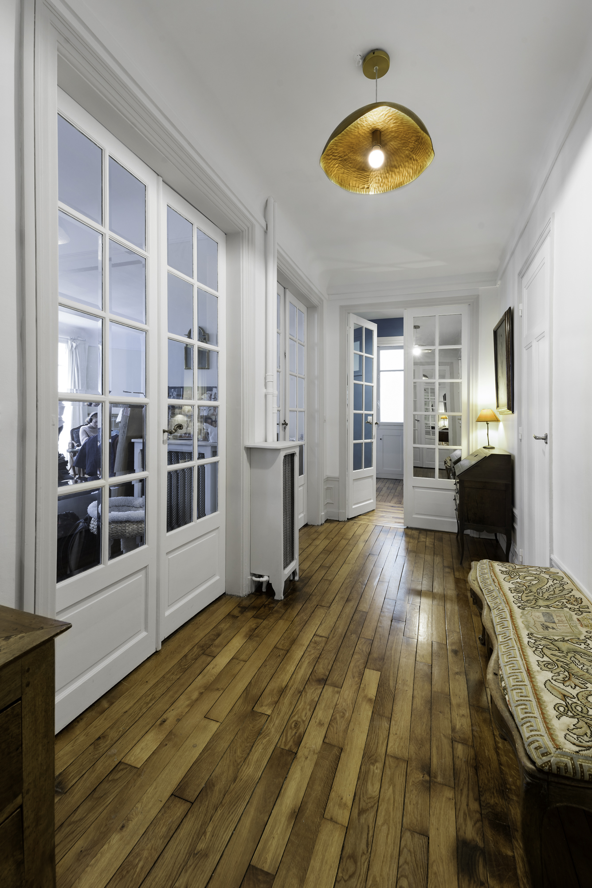

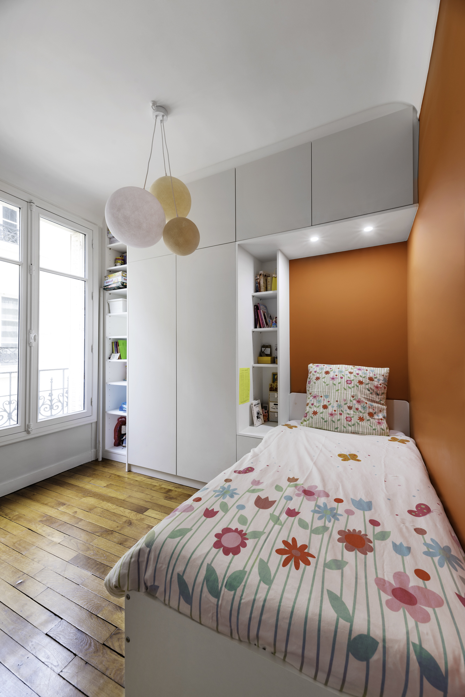

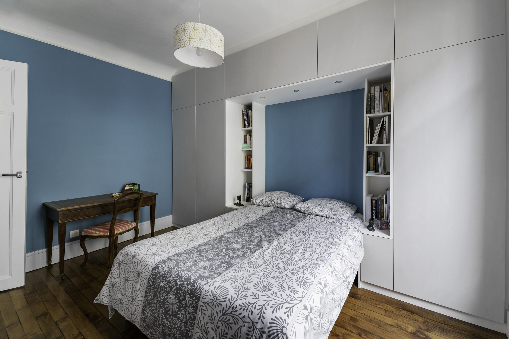

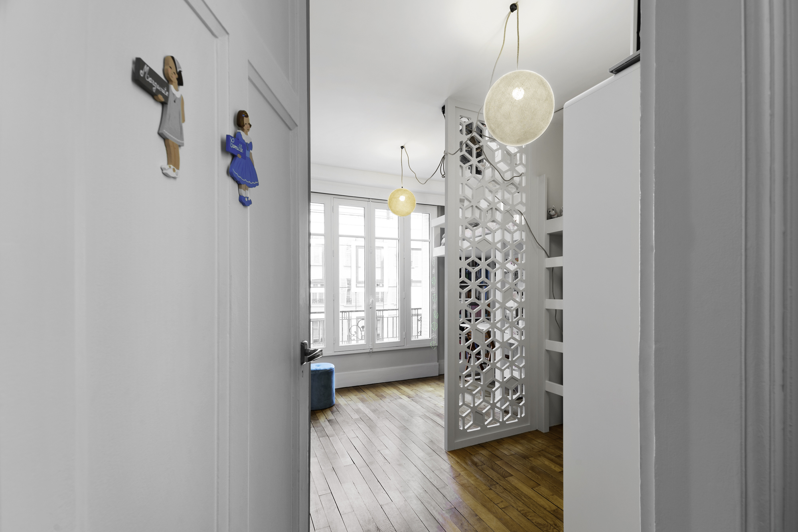

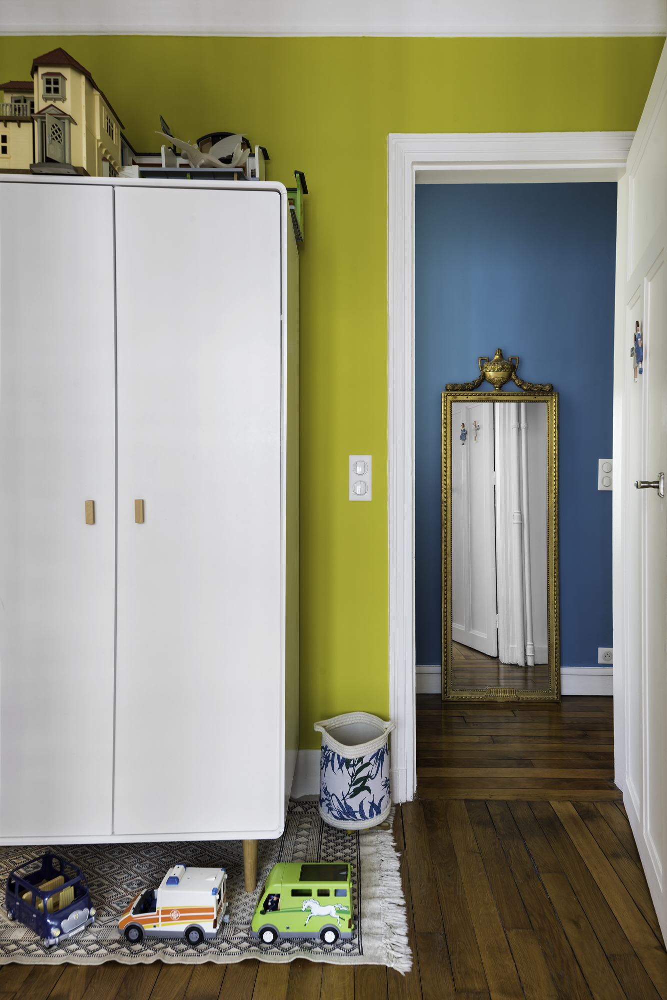

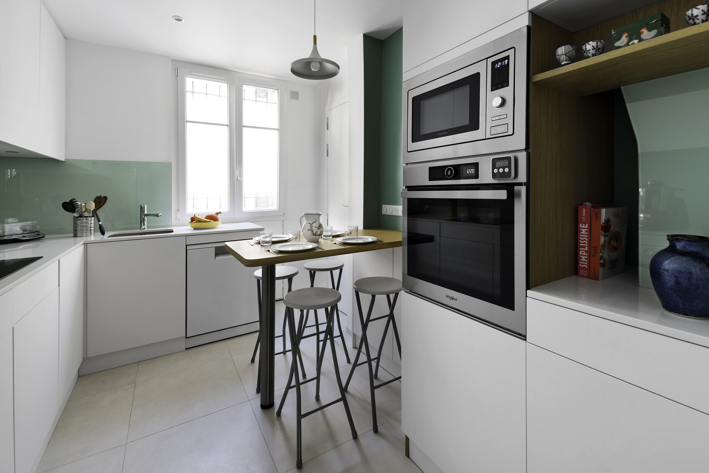

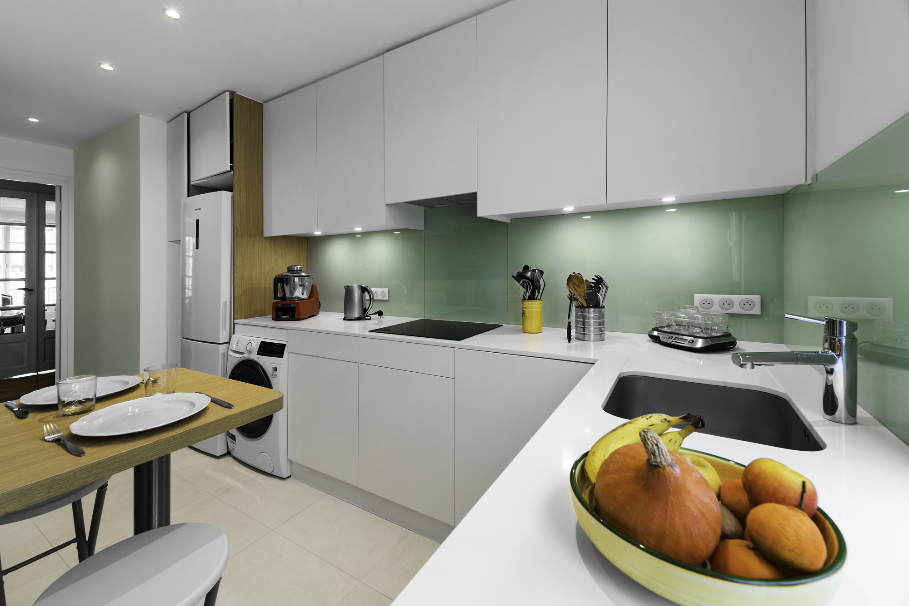

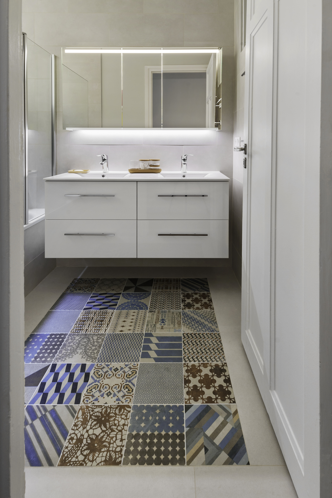

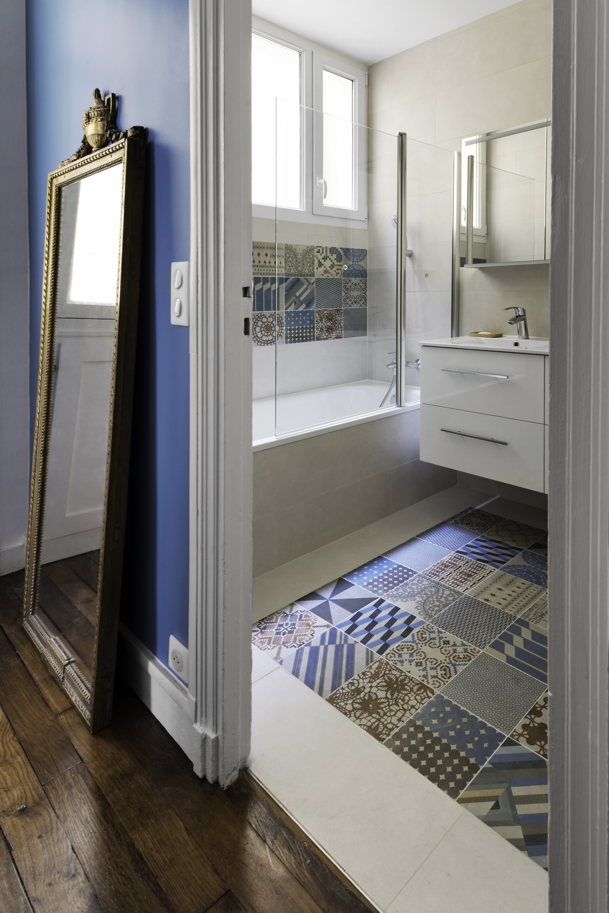

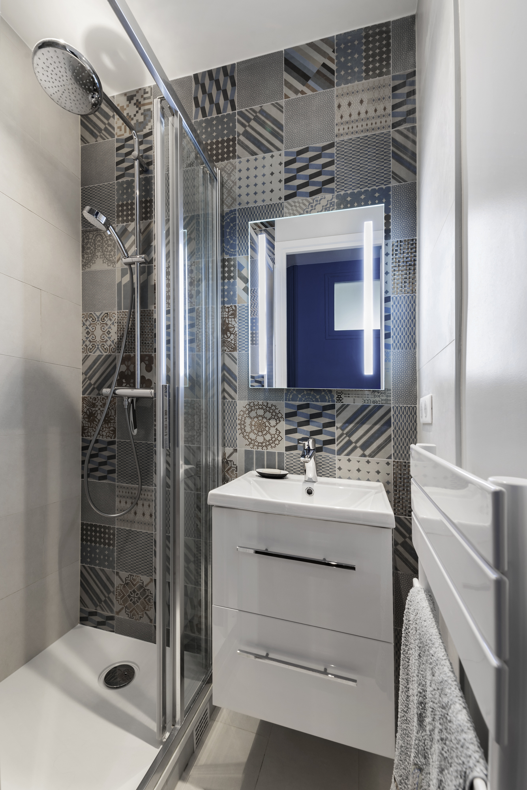

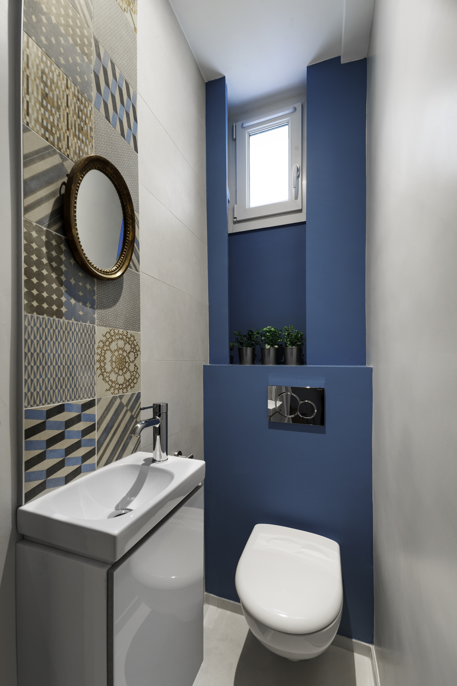

