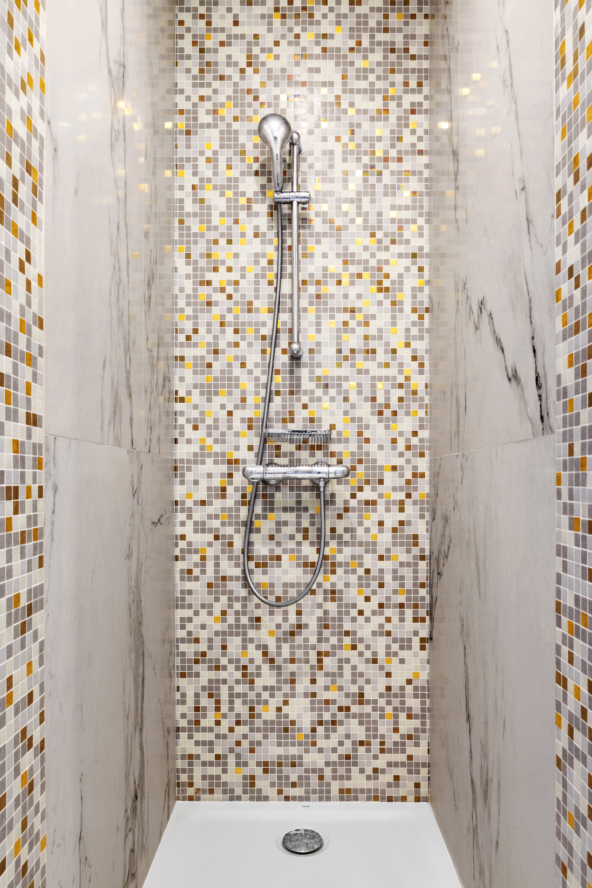

## Famille de 2 adultes et 4 adolescents. Immeuble 1930. 250 m². 7 mois de travaux.

Les volumes sont confortables, mais l’ensemble nécessite une refonte technique complète: électricité, plomberie, salle de bains et salles d’eau, cuisine et buanderie, chambres.
Murs, sols et plafond sont repris. Chacune des chambres dispose de sa salle d’eau.
L’espace de réception est vaste, l’ancien grand bureau est transformé en chambre et la grande bibliothèque est modernisée pour l’usage du jeune nouvel occupant cet espace. Cette pièce pourra à terme redevenir une bibliothèque-bureau et s’ouvrir à nouveau sur l’espace de réception, sans engager de gros travaux. Les nouveaux espaces de réception sont travaillés avec une gradation des couleurs dans une gamme de gris chauds et de blancs. Les espaces de transition: entrée et couloir menant aux chambres sont colorés.
L’enjeu est de créer pour chacun un univers coloré différenciant tout en conservent une cohérence à l’ensemble. Les parents ont souhaité un univers blanc, un esprit «1930» sera recherché dans les espaces parents et réception. Les chambres des enfants seront claires pour accueillir la lumière et les salles d’eau des 4 enfants se déclineront dans des gammes de bleu et de beige.
La cuisine existante très vaste est réaménagée en intégrant un bel espace buanderie et rangement. De grands plans de travail et l’aménagement de niches permettent de scénographier ce vaste espace habillé de rouge flamboyant et de deux tons gris. Entre cuisine et buanderie, une verrière permettra de profiter partout de la lumière naturelle de la cuisine, tout en séparant les espaces.

