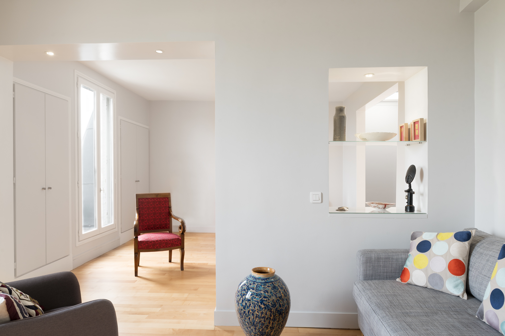
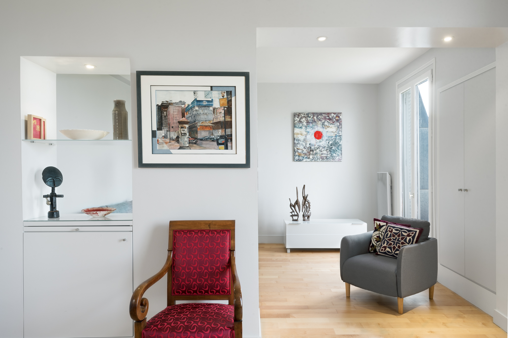
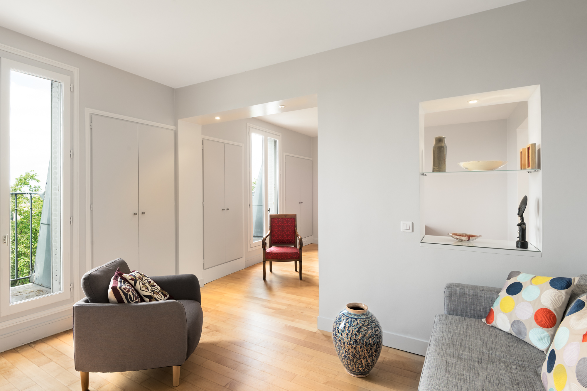
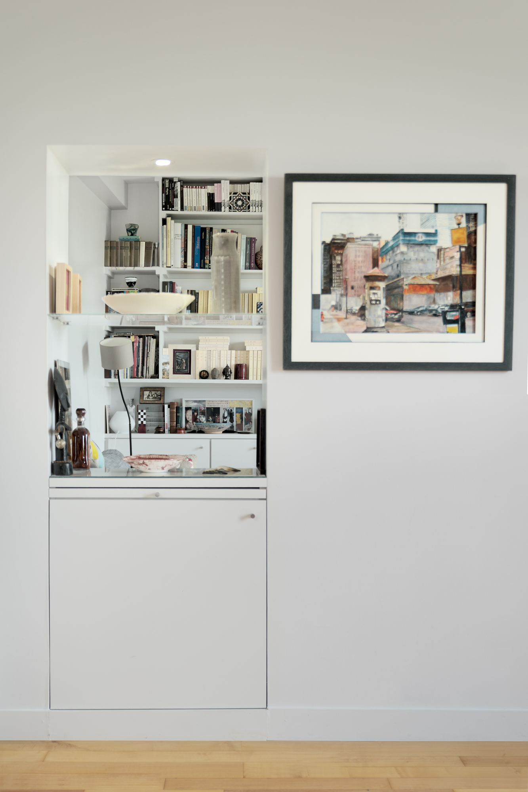

> ### Un couple. 
> ### Immeuble fin XIXème. 
> ### 50 m². 
> ### 4 mois de travaux.

Appartement composé de différentes chambres de service réunies, par un ancien propriétaire. L’appartement est sous les toits, isolé de celui-ci par un comble perdu et jouit d’une magnifique vue sur le jardin du Luxembourg. Un couloir distribue l’ensemble des chambres et l’ensemble est morcelé et soufre d’un manque d’unité. 

Refonte complète des espaces: fluidifier, alléger, ouvrir le couloir et unifier les pièces donnant sur le jardin pour créer un vrai salon. Faire pénétrer la lumière et ouvrir la vue sur la cime des arbres pour rendre l’appartement plus vivant. Refonte technique complète: démolition et reprise de murs porteurs, traitement de cheminées, électricité, plomberie, salle de bains. Murs, sols et plafond seront repris. 

Une bibliothèque et l’aménagement mobilier d’un ancien passage sont dessinés pour permettre de développer de la surface de rangement,  une mise en valeur d’objet d’art et révéler l’originalité des lieux. Un gris pâle et doux est choisi, pour capter la lumière sans éblouissement, le parquet en bois d’érable est repris pour son aspect chaleureux et contemporain.

Dans cet espace doux et clair, la neutralité des teintes permet la mise en valeur du paysage qu’est le jardin et celle des pièces artistiques qui reflètent la personnalité originale des occupants.

