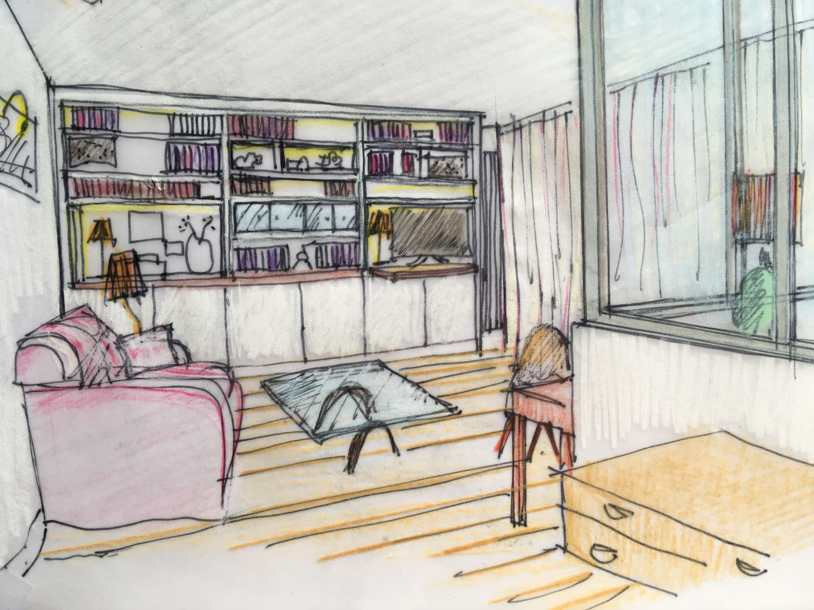
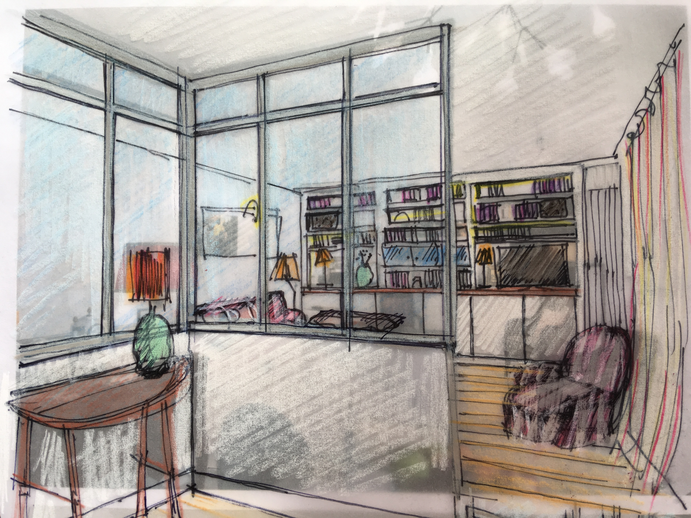
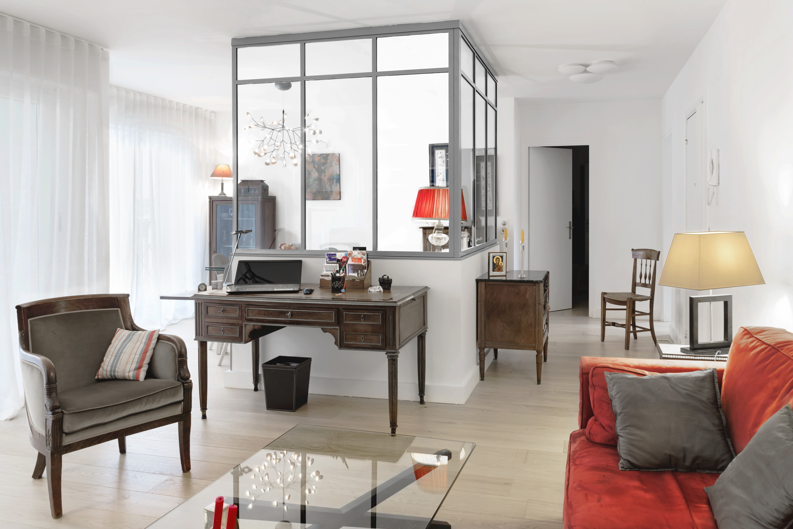

## Une famille de 2 adultes et un enfant. Immeuble des années 1970. 70 m². 5 mois de travaux. 

L’organisation de l’appartement est fonctionnelle. Les occupants souhaitent moderniser leur appartement, apporter une expression plus contemporaine, et surtout trouver plus de clarté. La nécessité de trouver des rangements, livres, objets, vaisselle et surtout matériel audio est exprimée. Electricité et plomberie sont intégralement revues dans l’espace de réception et la cuisine.

L’espace salon et salle à manger-bureau doit être rendu plus fluide. L’objectif est de faire entrer la lumière de la façade jusque dans l’entrée et faire communiquer visuellement cette entrée avec le salon et la salle à manger. La cuisine est intégralement revue dans son organisation avec l’aménagement d’un coin repas amovible. Les sols sont changés pour une meilleure réflexion lumineuse: d’un parquet à petit bois en damier d’une teinte sombre, vers des lames larges en chêne clair en pose à l’anglaise pour les espaces de réception et l’entrée, et de larges carreaux en grès cérame sable pour la cuisine.

Les caissons de volets roulants sont apparents et saillants en intérieur, ainsi trop présents dans la lecture du volume, ils sont masqués par une proposition de rideaux en lin formant un mouvement de vague venant chercher la lumière naturelle et la projetant en tous sens dans l’espace, améliorant la luminosité dans les pièces. Dans cette même volonté d’éclairer les espaces, les murs et le mobilier dessiné sont choisis d’un blanc presque pur. La cuisine dans une tonalité chaleureuse de bois, beige et blanc est réveillée par la pose d’une crédence de teinte orange vif.

