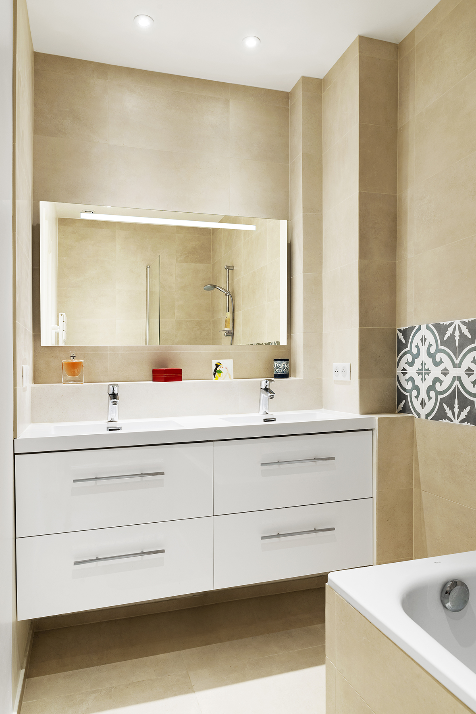

En tant qu'architecte, lors de la rénovation d'un grand appartement à Paris, mon travail consiste à élaborer les plans de l'appartement, en prenant en compte les besoins et souhaits du client, tout en respectant les règlementations et codes de construction en vigueur. Je travaille en étroite collaboration avec les autres membres de l'équipe de rénovation, tels que les ingénieurs et les entrepreneurs, pour s'assurer que tous les aspects de la rénovation se déroulent de manière fluide et efficace. Je suis également responsable de surveiller l'avancement du projet et de résoudre tout problème technique qui pourrait survenir pendant la rénovation.

